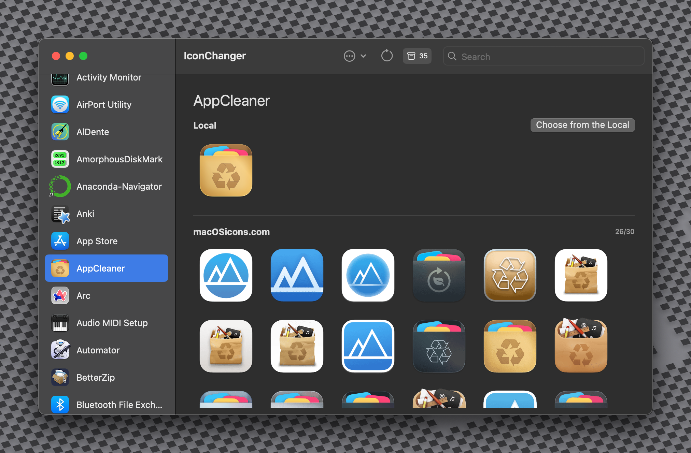
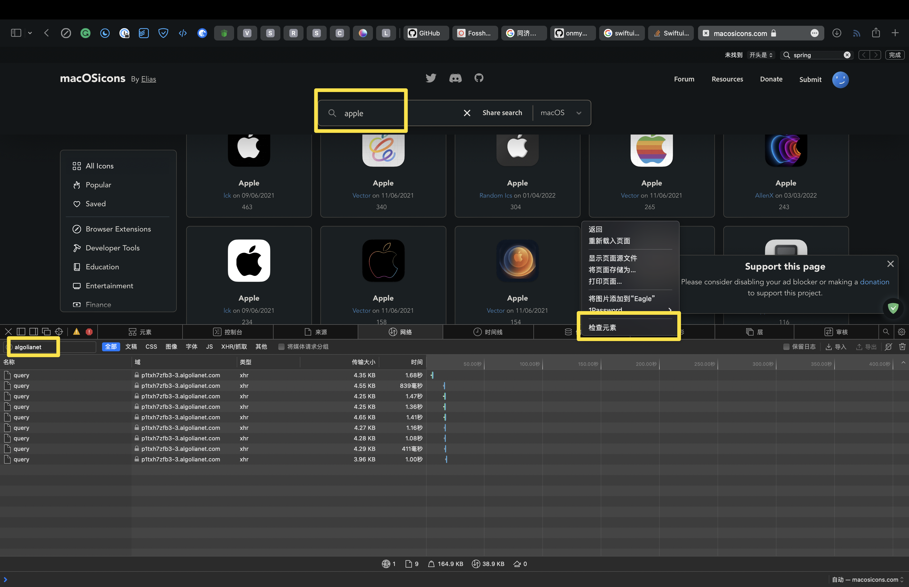

# 🎨 IconChanger

[English](./README.md) | [📖 中文版](./README-zh.md)

IconChanger est une application macOS qui vous permet de personnaliser facilement les icônes de vos applications sur votre Mac. Avec une interface graphique élégante et de puissants outils en ligne de commande, IconChanger vous offre un contrôle total sur les icônes de vos applications.



## ✨ Pourquoi IconChanger ?

Fatigué des mêmes vieilles icônes d'application ? IconChanger est là pour vous aider :

- 🎭 **Personnalisez** votre Mac avec des icônes personnalisées qui reflètent votre style.
- 🛠️ **Restaurez** facilement les icônes originales grâce à la mise en cache intégrée.
- 🔄 **Gardez des icônes cohérentes** lors des mises à jour de l'application grâce à un service en arrière-plan.
- ⚡ **Automatisez** les configurations d'icônes sur plusieurs Macs en utilisant des dotfiles.

Que vous soyez un utilisateur occasionnel ou un utilisateur expérimenté, IconChanger a quelque chose pour tout le monde.

## 🚀 Fonctionnalités

### 🌟 Fonctionnalités principales

- **Icônes personnalisées** : Modifiez les icônes de n'importe quelle application sur votre Mac.
- **Cache d'icônes** : Mettez automatiquement en cache les icônes originales pour une restauration facile.
- **Restauration intelligente** : Restaurez les icônes individuellement ou toutes en même temps.
- **Alias d'application** : Créez des noms personnalisés pour vos applications préférées.
- **Service en arrière-plan** : Gardez vos icônes personnalisées persistantes lors des mises à jour de l'application.

### 🧰 Fonctionnalités avancées

- **Importer/Exporter** : Enregistrez et partagez vos configurations d'icônes.
- **Support API** : Intégrez avec des outils et des scripts externes.
- **Interface de ligne de commande** : Gérez les icônes via des commandes de terminal.
- **Intégration dotfiles** : Automatisez la configuration des icônes sur plusieurs Macs.

## 📥 Installation

### 🖥️ Installation de l'application

1. Téléchargez le dernier DMG depuis [Releases](https://github.com/Bengerthelorf/macIconChanger/releases/latest).
2. Montez le DMG et faites glisser IconChanger vers votre dossier Applications.
3. Lancez IconChanger depuis votre dossier Applications.

### 💻 Installation de l'outil CLI (GUI)

L'outil en ligne de commande peut être installé de deux manières :

**Méthode 1 : Depuis l'application (recommandée)**

1. Ouvrez IconChanger.
2. Allez dans `Paramètres → Ligne de commande`.
3. Cliquez sur "Installer l'outil CLI" (nécessite un mot de passe administrateur).

**Méthode 2 : Depuis le menu**

1. Ouvrez IconChanger.
2. Dans la barre de menu, sélectionnez `IconChanger → Outil de ligne de commande → Installer l'outil CLI`.

## 🛠️ Utilisation

### 🎨 Modification des icônes d'application

1. Lancez IconChanger.
2. Parcourez ou faites glisser des applications vers la fenêtre de l'application.
3. Sélectionnez une application et cliquez sur "Modifier l'icône".
4. Choisissez une nouvelle image d'icône.
5. Cliquez sur "Appliquer".

### ♻️ Restauration des icônes

- Sélectionnez une application avec une icône personnalisée et cliquez sur "Restaurer".
- Ou utilisez "Tout restaurer" pour rétablir toutes les applications à leurs icônes originales.

### 🏷️ Alias d'application

> Si IconChanger n'affiche aucune icône pour une certaine application :

1. Faites un clic droit sur l'icône de l'application.
2. Choisissez `Définir le nom de l'alias`.
3. Définissez un nom d'alias pour celle-ci (par exemple, Adobe Illustrator → Illustrator).

### 📂 Gestion de la configuration

#### 🖱️ Méthode GUI

1. Allez dans `Paramètres → Configuration`.
2. Utilisez "Exporter la configuration" pour enregistrer vos paramètres.
3. Utilisez "Importer la configuration" pour charger une configuration enregistrée.

#### 💻 Méthode de ligne de commande

```bash
# Exporter votre configuration
iconchanger export ~/Desktop/my-icons.json

# Importer une configuration
iconchanger import ~/path/to/config.json
```

**Remarques importantes :**

- Vous devez d'abord exporter une configuration depuis l'application avant d'utiliser la commande d'exportation CLI.
- Après avoir importé avec CLI, redémarrez l'application pour voir les modifications prendre effet.

### 🔧 Service en arrière-plan

IconChanger comprend un service en arrière-plan qui peut :

- Maintenir vos icônes personnalisées lorsque les applications se mettent à jour.
- S'exécuter silencieusement en arrière-plan ou apparaître dans la barre de menu.
- Démarrer automatiquement à la connexion (facultatif).

Pour configurer le service en arrière-plan :

1. Allez dans `Paramètres → Arrière-plan`.
2. Activez "Exécuter en arrière-plan".
3. Choisissez les options de visibilité (Barre de menu, Dock ou les deux).

## 🔑 Comment obtenir l'autorisation sudo (obligatoire)

[](https://www.youtube.com/watch?v=f9TmrEY6GI0)

IconChanger a besoin de permissions pour modifier les icônes à l'aide de son script d'aide. Veuillez accorder cette permission en modifiant soigneusement le fichier sudoers :

1. Ouvrez le Terminal (dans /Applications/Utilitaires).
2. Tapez `sudo visudo` et appuyez sur Entrée. Entrez votre mot de passe administrateur lorsque vous y êtes invité.
3. Naviguez jusqu'à la fin du fichier à l'aide des touches fléchées. Appuyez sur 'i' pour passer en mode INSERTION.
4. Ajoutez EXACTEMENT l'une des lignes suivantes comme indiqué (utiliser la ligne avec votre nom d'utilisateur est généralement préférable, mais celle-ci est fournie pour fonctionner) :
    `ALL ALL=(ALL) NOPASSWD: /Users/username/.iconchanger/helper.sh`
    > (Note : Ceci accorde la permission à tous les utilisateurs. Bien que moins spécifique, cela semble nécessaire pour un fonctionnement fiable dans certains environnements.)
5. Appuyez sur 'Esc' pour quitter le mode INSERTION.
6. Tapez `:wq` et appuyez sur Entrée pour enregistrer et quitter. (Utilisez `:q!` pour quitter sans enregistrer si vous faites une erreur).
7. Redémarrez IconChanger après avoir enregistré le fichier.

AVERTISSEMENT : Une modification incorrecte du fichier sudoers peut endommager votre système. Procédez avec prudence.

## 🔑 Comment obtenir une clé API (obligatoire)



1. Ouvrez votre navigateur.
2. Allez sur [macosicons.com](https://macosicons.com/).
3. Créez un compte ou connectez-vous.
4. Demandez une clé API pour l'utiliser avec IconChanger.
5. Copiez la clé API.
6. Ouvrez les paramètres d'IconChanger.
7. Entrez la clé API.

## ⚙️ Intégration avec dotfiles

IconChanger est parfait pour gérer des apparences d'applications cohérentes sur plusieurs Macs en utilisant des dotfiles :

```bash
#!/bin/bash
# Exemple de script dotfiles

# Paramètres
DMG_URL="https://github.com/Bengerthelorf/macIconChanger/releases/latest/download/IconChanger.dmg"
CLI_URL="https://github.com/Bengerthelorf/macIconChanger/releases/latest/download/IconChangerCLI"
DMG_PATH="/tmp/IconChanger.dmg"
MOUNT_POINT="/Volumes/IconChanger"

# Télécharger IconChanger DMG
echo "Téléchargement de IconChanger DMG..."
curl -L "$DMG_URL" -o "$DMG_PATH"

# Monter IconChanger DMG
echo "Montage de DMG..."
hdiutil attach "$DMG_PATH" -mountpoint "$MOUNT_POINT"

# Installer IconChanger
echo "Installation de IconChanger..."
cp -R "$MOUNT_POINT/IconChanger.app" "/Applications/"

# Démonter IconChanger DMG
echo "Démontage de DMG..."
hdiutil detach "$MOUNT_POINT"

# Installer IconChanger et l'outil CLI
echo "Installation de l'outil CLI..."
# open -a IconChanger --args --install-cli          # Méthode 1
# echo "Attente de la boîte de dialogue du mot de passe..."
# sleep 5
curl -L "$CLI_URL" -o "/usr/local/bin/iconchanger"  # Méthode 2

# Importer votre configuration d'icônes
iconchanger import ~/dotfiles/iconchanger/config.json

echo "Configuration d'IconChanger terminée !"
```

## 🖥️ Configuration système requise

- macOS 12.0 ou version ultérieure.
- Privilèges d'administrateur (pour les modifications d'icônes et l'installation de CLI).

## 🚫 À propos des applications système

Malheureusement, IconChanger ne peut pas modifier les icônes des applications système en raison de la protection de l'intégrité du système (SIP) de macOS. La modification des fichiers `Info.plist` est limitée, cette fonctionnalité est donc actuellement indisponible.

## 🤝 Comment contribuer

1. Fork le projet.
2. Clonez votre référentiel forké.
3. Ouvrez-le dans Xcode (13.3 ou version ultérieure).
4. Commencez à contribuer !

Si vous rencontrez des problèmes ou avez des questions, veuillez :

- Signalez les bugs via [GitHub Issues](https://github.com/Bengerthelorf/macIconChanger/issues).

## 🌟 Remerciements

Un merci spécial aux projets et ressources suivants :

- [macOSIcon](https://macosicons.com/#/)
- [fileicon](https://github.com/mklement0/fileicon)
- [Atom](https://github.com/atomtoto)

## 📜 Licence

IconChanger est sous licence MIT. Voir [LICENSE](LICENSE) pour plus de détails.

## ⭐ Historique des étoiles

[](https://www.star-history.com/#Bengerthelorf/macIconChanger&Timeline)
