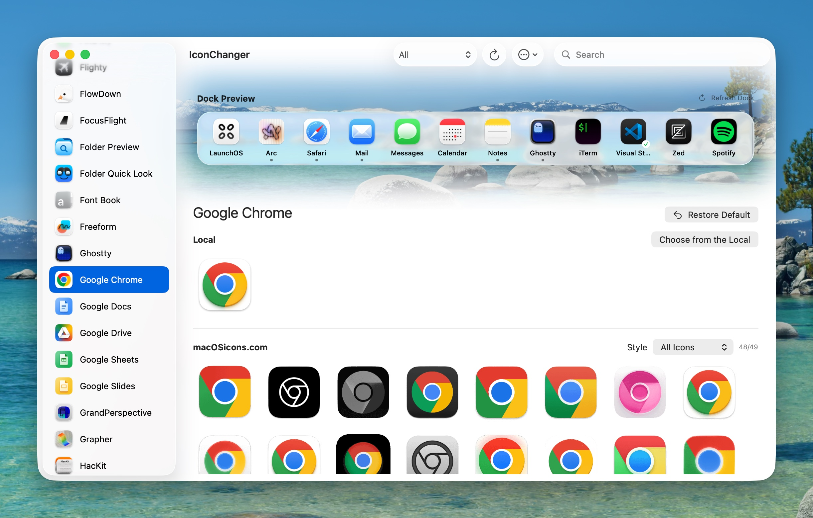
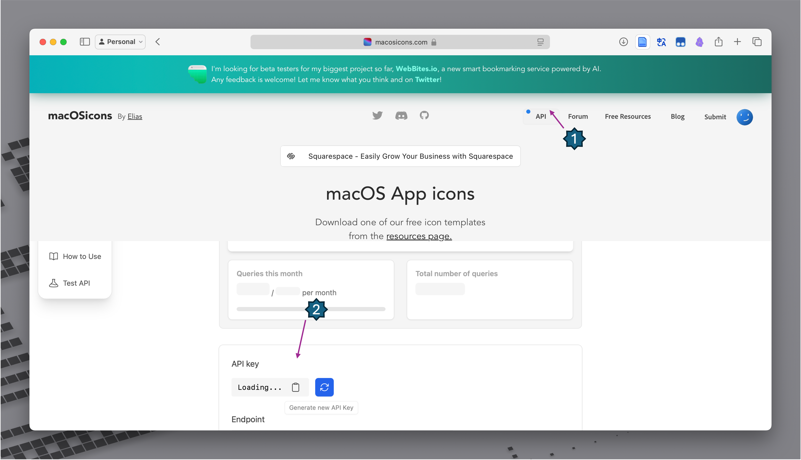

# IconChanger

[English](./README.md) | [Version française](./README-fr.md)

一款用于自定义 macOS 应用图标的工具，提供简洁的图形界面和强大的命令行支持。



## 功能

- **自定义图标** — 通过 GUI 或命令行更改 Mac 上任何应用的图标
- **图标缓存** — 自动缓存自定义图标，便于恢复
- **后台服务** — 定时恢复和应用更新检测，确保自定义图标不丢失
- **开机自启** — 登录时自动启动，可选择打开窗口或静默运行
- **应用别名** — 为应用设置搜索别名，提高图标搜索命中率
- **导入/导出** — 保存、分享和恢复图标配置
- **CLI 工具** — 完整的命令行工具，支持 8 个命令
- **多语言** — 支持 30 种语言

## 安装

### Homebrew

```bash
brew install Bengerthelorf/tap/iconchanger
```

### 手动安装

1. 从 [Releases](https://github.com/Bengerthelorf/macIconChanger/releases/latest) 下载最新 DMG。
2. 将 IconChanger 拖入应用程序文件夹。
3. 启动并按照提示完成一次性权限配置。

### CLI 工具

1. 打开 IconChanger → `设置` → `高级`。
2. 在命令行工具下点击 **安装**（需要管理员密码）。
3. 终端中即可使用 `iconchanger` 命令。

## 使用

### 更改图标（GUI）

1. 从侧边栏选择应用。
2. 搜索图标或选择本地图片。
3. 点击应用。

### 更改图标（CLI）

```bash
# 设置自定义图标
iconchanger set-icon /Applications/Safari.app ~/icons/safari.png

# 移除自定义图标（恢复默认）
iconchanger remove-icon /Applications/Safari.app

# 恢复所有缓存的自定义图标（如系统更新后）
iconchanger restore

# 预览恢复操作
iconchanger restore --dry-run --verbose
```

### 应用别名

如果搜索某个应用时没有找到图标：

1. 右键侧边栏中的应用 → **设置别名**。
2. 输入便于搜索的名称（如 `Adobe Illustrator 2023` → `Illustrator`）。

### 配置管理

```bash
# 导出配置（别名 + 缓存图标）
iconchanger export ~/Desktop/my-icons.json

# 导入配置
iconchanger import ~/Desktop/my-icons.json

# 导入前验证配置文件
iconchanger validate ~/Desktop/my-icons.json

# 查看设置状态
iconchanger status

# 列出所有别名和缓存图标
iconchanger list
```

### 后台服务

在 `设置` → `后台` 中配置：

- **后台运行** — 关闭窗口后保持运行
- **定时恢复图标** — 按设定间隔自动恢复图标
- **应用更新时恢复图标** — 检测应用更新并自动重新应用自定义图标
- **显示在菜单栏 / Dock** — 选择后台运行时的显示方式
- **开机自启** — 登录时自动启动，可配置启动行为

## 初始配置

首次启动时，IconChanger 会提示完成权限配置。点击设置按钮并输入管理员密码即可（自动配置 sudoers 规则）。

如需手动配置，通过 `sudo visudo` 添加：

```
ALL ALL=(ALL) NOPASSWD: /Users/<你的用户名>/.iconchanger/helper.sh
```

## API 密钥

在线搜索图标需要 [macosicons.com](https://macosicons.com/) 的 API 密钥。

1. 访问 [macosicons.com](https://macosicons.com/) 并注册账号。
2. 申请 API 密钥。
3. 在 `设置` → `高级` → `API Key` 中输入。

也可以直接使用本地图标文件，无需 API 密钥。



## 通过 dotfiles 自动化

```bash
#!/bin/bash
DMG_URL="https://github.com/Bengerthelorf/macIconChanger/releases/latest/download/IconChanger.dmg"
DMG_PATH="/tmp/IconChanger.dmg"

# 安装应用
curl -L "$DMG_URL" -o "$DMG_PATH"
hdiutil attach "$DMG_PATH" -mountpoint /Volumes/IconChanger
cp -R /Volumes/IconChanger/IconChanger.app /Applications/
hdiutil detach /Volumes/IconChanger

# 安装 CLI（从应用包中提取）
sudo cp /Applications/IconChanger.app/Contents/Resources/IconChangerCLI /usr/local/bin/iconchanger
sudo chmod +x /usr/local/bin/iconchanger

# 导入图标配置
iconchanger import ~/dotfiles/iconchanger/config.json
```

## 系统要求

- macOS 13.0 或更高版本
- 管理员权限（用于初始配置和更改图标）

## 限制

受 macOS 系统完整性保护（SIP）限制，无法更改系统应用的图标。

## 贡献

1. Fork 本项目。
2. 克隆并用 Xcode 15+ 打开。
3. 开始贡献！

通过 [GitHub Issues](https://github.com/Bengerthelorf/macIconChanger/issues) 报告问题。

## 致谢

- [underthestars-zhy/IconChanger](https://github.com/underthestars-zhy/IconChanger) — 原始项目
- [lcandy2](https://github.com/lcandy2) — 本项目基于其 Fork 版本开发
- [macOSicons.com](https://macosicons.com/#/) — 图标数据库
- [fileicon](https://github.com/mklement0/fileicon) — 图标操作工具
- [Atom](https://github.com/atomtoto) — 贡献者

## 许可证

MIT 许可证。详情参见 [LICENSE](LICENSE)。

## Star 历史

[](https://www.star-history.com/#Bengerthelorf/macIconChanger&Timeline)
