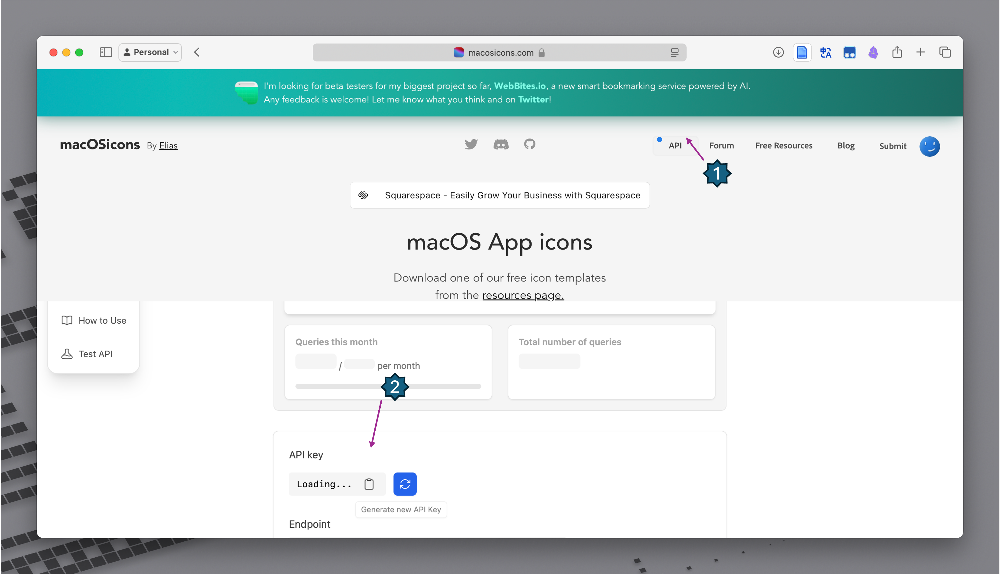

# 🎨 IconChanger

[🇬🇧 English](./README.md) | [🇫🇷 Version française](./README-fr.md)

IconChanger 是一个 macOS 应用程序，可以让您轻松自定义 Mac 上的应用程序图标。通过简洁的图形界面和强大的命令行工具，IconChanger 为您提供了完全控制应用图标的能力。


## ✨ 为什么选择 IconChanger？

厌倦了一成不变的应用图标？IconChanger 可以帮助您：

- 🎭 **个性化** 您的 Mac，使用反映您风格的自定义图标。
- 🛠️ **恢复** 原始图标，内置缓存功能让操作更简单。
- 🔄 **保持一致**，通过后台服务在应用更新时保持图标不变。
- ⚡ **自动化**，使用 dotfiles 在多台 Mac 上设置图标。

无论您是普通用户还是高级用户，IconChanger 都能满足您的需求。

## 🚀 功能

### 🌟 核心功能

- **自定义图标**：更改 Mac 上任何应用程序的图标。
- **图标缓存**：自动缓存原始图标，方便恢复。
- **智能恢复**：单独或一次性恢复所有图标。
- **应用别名**：为您喜爱的应用程序创建自定义名称。
- **后台服务**：在应用更新时保持自定义图标。

### 🧰 高级功能

- **导入/导出**：保存并共享您的图标配置。
- **API 支持**：与外部工具和脚本集成。
- **命令行界面**：通过终端命令管理图标。
- **dotfiles 集成**：在多台 Mac 上自动设置图标。

## 📥 安装

### 🖥️ 应用安装

1. 从 [Releases](https://github.com/Bengerthelorf/macIconChanger/releases/latest) 下载最新的 DMG 文件。
2. 挂载 DMG 文件并将 IconChanger 拖动到您的应用程序文件夹。
3. 从应用程序文件夹启动 IconChanger。

### 💻 CLI 工具安装 (GUI)

命令行工具可以通过以下两种方式安装：

**方法 1：通过应用程序（推荐）**

1. 打开 IconChanger。
2. 转到 `设置 → 命令行`。
3. 点击“安装 CLI 工具”（需要管理员密码）。

**方法 2：通过菜单**

1. 打开 IconChanger。
2. 从菜单栏选择 `IconChanger → 命令行工具 → 安装 CLI 工具`。

## 🛠️ 使用方法

### 🎨 更改应用图标

1. 启动 IconChanger。
2. 浏览或拖动应用程序到窗口。
3. 选择一个应用程序并点击“更改图标”。
4. 选择一个新的图标图片。
5. 点击“应用”。

### ♻️ 恢复图标

- 选择一个自定义图标的应用程序并点击“恢复”。
- 或使用“全部恢复”将所有应用程序恢复为原始图标。

### 🏷️ 应用别名

> 如果 IconChanger 没有显示某个应用的图标：

1. 右键点击应用图标。
2. 选择 `设置别名`。
3. 为其设置一个别名（例如 Adobe Illustrator → Illustrator）。

### 📂 配置管理

#### 🖱️ 图形界面方法

1. 转到 `设置 → 配置`。
2. 使用“导出配置”保存您的设置。
3. 使用“导入配置”加载已保存的配置。

#### 💻 命令行方法

```bash
# 导出您的配置
iconchanger export ~/Desktop/my-icons.json

# 导入配置
iconchanger import ~/path/to/config.json
```

**重要提示：**

- 您必须先从应用程序导出配置，然后才能使用 CLI 导出命令。
- 使用 CLI 导入后，重新启动应用程序以使更改生效。

### 🔧 后台服务

IconChanger 包含一个后台服务，可以：

- 在应用程序更新时维护您的自定义图标。
- 静默运行或显示在菜单栏中。
- 可选地在登录时自动启动。

要配置后台服务：

1. 转到 `设置 → 后台`。
2. 启用“后台运行”。
3. 选择可见性选项（菜单栏、Dock 或两者）。

## 🔑 如何获取权限 (必需)

IconChanger 需要权限才能使用其辅助脚本更改图标。请仔细编辑 sudoers 文件以授予此权限:

1. 打开“终端”（位于“/应用程序/实用工具”中）。
2. 输入 `sudo visudo` 并按 Enter 键。在提示时输入您的管理员密码。
3. 使用箭头键导航到文件末尾。按 'i' 进入插入模式。
4. 完全按照所示添加以下任一行（通常首选使用您的用户名对应的格式，但此处提供通用格式）：
    `ALL ALL=(ALL) NOPASSWD: /Users/username/.iconchanger/helper.sh`
    > (注意：这将权限授予所有用户。虽然不够具体，但在某些环境中似乎是可靠运行所必需的。)
5. 按 'Esc' 键退出插入模式。
6. 输入 `:wq` 并按 Enter 键保存并退出。（如果出错，输入 `:q!` 并按 Enter 键退出而不保存）。
7. 保存文件后重新启动 IconChanger。

警告：错误地编辑 sudoers 文件可能会损坏您的系统。请谨慎操作。

### ⬇️ 点击查看视频教程

[](https://www.bilibili.com/video/av114416603370208/)

## 🔑 如何获取 API 密钥（必需）



1. 打开浏览器。
2. 访问 [macosicons.com](https://macosicons.com/)。
3. 创建账户或登录。
4. 请求用于 IconChanger 的 API 密钥。
5. 复制 API 密钥。
6. 打开 IconChanger 设置。
7. 输入 API 密钥。

## ⚙️ 与 dotfiles 集成

IconChanger 非常适合通过 dotfiles 在多台 Mac 上管理一致的应用外观：

```bash
#!/bin/bash
# 示例 dotfiles 脚本

# 参数
DMG_URL="https://github.com/Bengerthelorf/macIconChanger/releases/latest/download/IconChanger.dmg"
CLI_URL="https://github.com/Bengerthelorf/macIconChanger/releases/latest/download/IconChangerCLI"
DMG_PATH="/tmp/IconChanger.dmg"
MOUNT_POINT="/Volumes/IconChanger"

# 下载 IconChanger DMG
echo "正在下载 IconChanger DMG..."
curl -L "$DMG_URL" -o "$DMG_PATH"

# 挂载 IconChanger DMG
echo "挂载 DMG..."
hdiutil attach "$DMG_PATH" -mountpoint "$MOUNT_POINT"

# 安装 IconChanger
echo "安装 IconChanger..."
cp -R "$MOUNT_POINT/IconChanger.app" "/Applications/"

# 卸载 IconChanger DMG
echo "卸载 DMG..."
hdiutil detach "$MOUNT_POINT"

# 安装 IconChanger 和 CLI 工具
echo "安装 CLI 工具..."
# open -a IconChanger --args --install-cli          # 方法 1
# echo "等待密码对话框..."
# sleep 5
curl -L "$CLI_URL" -o "/usr/local/bin/iconchanger"  # 方法 2

# 导入您的图标配置
iconchanger import ~/dotfiles/iconchanger/config.json

echo "IconChanger 设置完成！"
```

## 🖥️ 系统要求

- macOS 12.0 或更高版本。
- 管理员权限（用于更改图标和安装 CLI）。

## 🚫 关于系统应用

很遗憾，由于 macOS 的系统完整性保护（SIP），IconChanger 无法更改系统应用程序的图标。修改 `Info.plist` 文件受到限制，因此此功能目前不可用。

## 🤝 如何贡献

1. Fork 此项目。
2. 克隆您的 Fork 仓库。
3. 在 Xcode（13.3 或更高版本）中打开。
4. 开始贡献！

如果您遇到任何问题或有疑问，请：

- 通过 [GitHub Issues](https://github.com/Bengerthelorf/macIconChanger/issues) 报告错误。

## 🌟 致谢

特别感谢以下项目和资源：

- [macOSIcon](https://macosicons.com/#/)
- [fileicon](https://github.com/mklement0/fileicon)
- [Atom](https://github.com/atomtoto)

## 📜 许可证

IconChanger 根据 MIT 许可证授权。有关详细信息，请参阅 [LICENSE](LICENSE)。

## ⭐ Star 历史

[](https://www.star-history.com/#Bengerthelorf/macIconChanger&Timeline)
