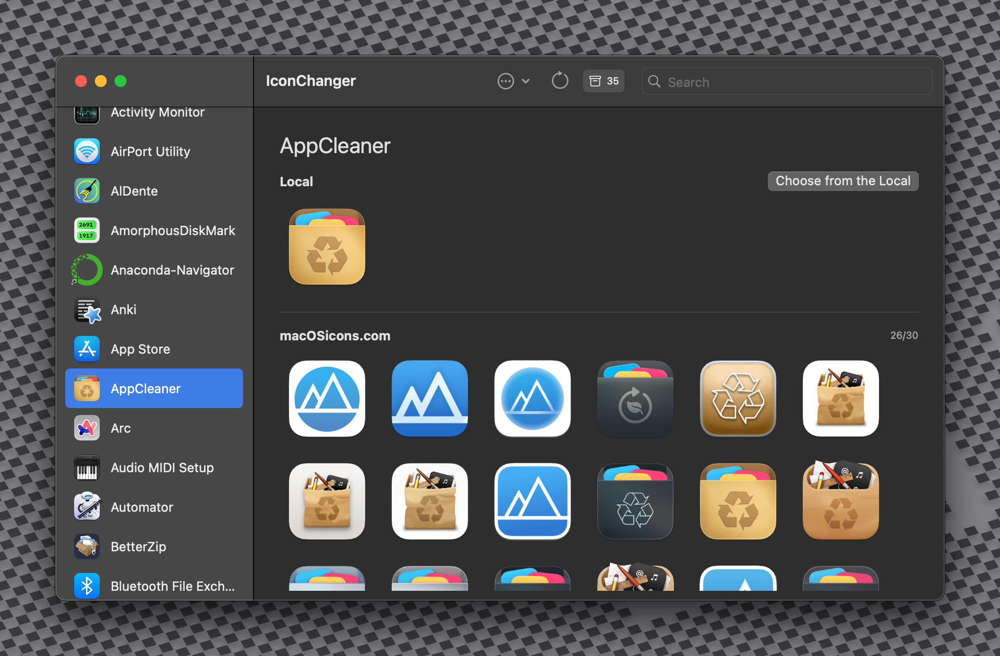

# IconChanger

[中文版](./README-zh.md) | [Version française](./README-fr.md)

IconChanger is an app that can change you app's icon. It simplifies your icon changing process.
  

## How to use

1. Go to github release
2. Download the latest app
3. Move the App to the Application folder

## If IconChanger doens't show any icon for certain App

1. Right click the app's icon
2. Choose `Set the Alias Name`
3. Set a alias name for it (Like Adobe Illustrator -> Illustrator)

## How to get API key (required)

1. Open your browser
2. Go to https://macosicons.com/
3. Create an account or log in
4. Go to your profile settings
5. Request an API key for use with IconChanger
6. Copy the API key
7. Open the IconChanger Settings
8. Input the API key

## About System App

Very sorry to say, but currently, we cannot change the icon of System Apps. Because of the SIP, users or root cannot write things to this app. And the idea of the Bridge App needs to change the `Info.plist`, so it will not work.

## How to contribute

1. Fork the project
2. Download the Fork
3. Open it in the Xcode (>13.3)
4. Start the Contibution

## Acknowledgement

* [macOSIcon](https://macosicons.com/#/)
* [fileiocn](https://github.com/mklement0/fileicon)
* [Atom](https://github.com/atomtoto)
