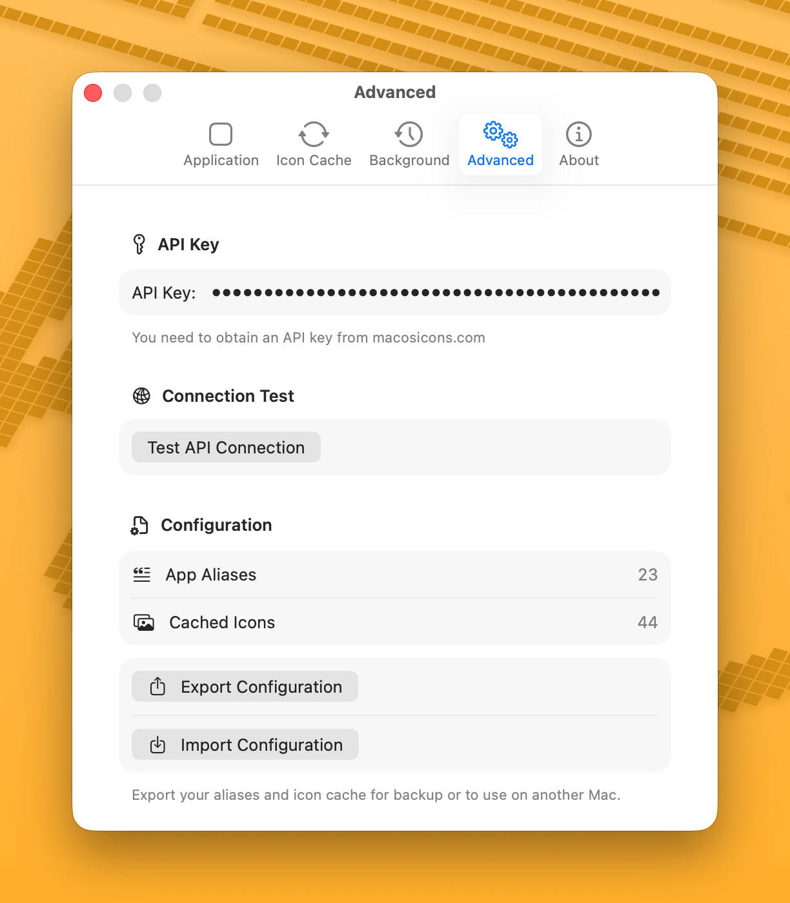

# API Key

An API key from [macosicons.com](https://macosicons.com/) is required to search for icons online. Without it, you can still use local image files.

## Getting an API Key

1. Visit [macosicons.com](https://macosicons.com/) and create an account.
2. Request an API key from your account settings.
3. Copy the key.

<!--  -->

## Entering the Key

1. Open IconChanger.
2. Go to **Settings** > **Advanced**.
3. Paste your API key in the **API Key** field.
4. Click **Test Connection** to verify it works.

<!--  -->

## Using Without an API Key

You can still change app icons without an API key by:

- Using local image files (click **Choose from the Local** or drag & drop an image)
- Using icons bundled within the app itself (shown in the "Local" section)

## Troubleshooting

If the API test fails:
- Check that your key is correct (no extra spaces)
- Verify your internet connection
- The macosicons.com API may be temporarily unavailable
