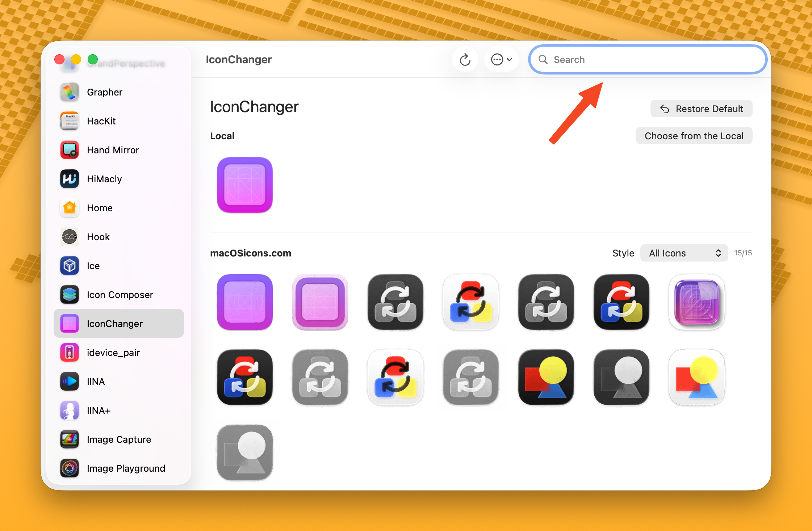
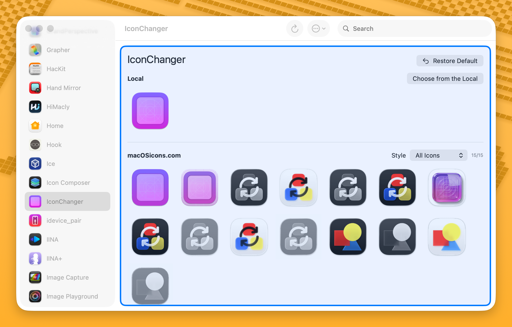

# Changing Icons

## Using the GUI

### Search Online

1. Select an app from the sidebar.
2. Browse the icons from [macOSicons.com](https://macosicons.com/) in the main area.
3. Use the **Style** dropdown to filter by style (e.g., Liquid Glass).
4. Click an icon to apply it.

<!--  -->

### Choose a Local File

Click **Choose from the Local** (or press <kbd>Cmd</kbd>+<kbd>O</kbd>) to open a file picker. Supported formats: PNG, JPEG, ICNS, TIFF, HEIC, WebP, BMP, GIF, SVG.

### Drag & Drop

Drag an image file from Finder directly onto the app's icon area. A blue highlight will appear to confirm the drop zone.

<!--  -->

### Restore Default Icon

To restore an app's original icon:
- Click the **Restore Default** button (or press <kbd>Cmd</kbd>+<kbd>Delete</kbd>)
- Or right-click the app in the sidebar and select **Restore Default Icon**

## Icon Caching

When you apply a custom icon, it is automatically cached. This means:
- Your custom icons can be restored after app updates
- The background service can reapply them on a schedule
- You can export and import your icon configurations

Manage cached icons in **Settings** > **Icon Cache**.

## Keyboard Shortcuts

| Shortcut | Action |
|---|---|
| <kbd>Cmd</kbd>+<kbd>O</kbd> | Choose a local icon file |
| <kbd>Cmd</kbd>+<kbd>Delete</kbd> | Restore default icon |
| <kbd>Cmd</kbd>+<kbd>R</kbd> | Refresh icon display |

## Tips

- If no icons are found for an app, try [setting an alias](./aliases) with a simpler name.
- The counter (e.g., "12/15") shows how many icons loaded successfully out of the total found.
- Icons are sorted by popularity (download count) by default.
