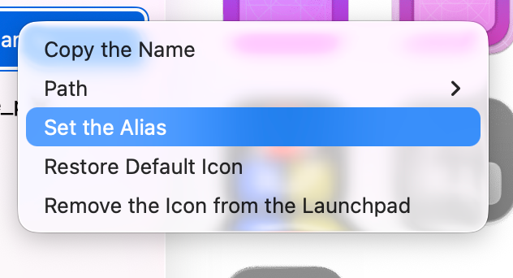
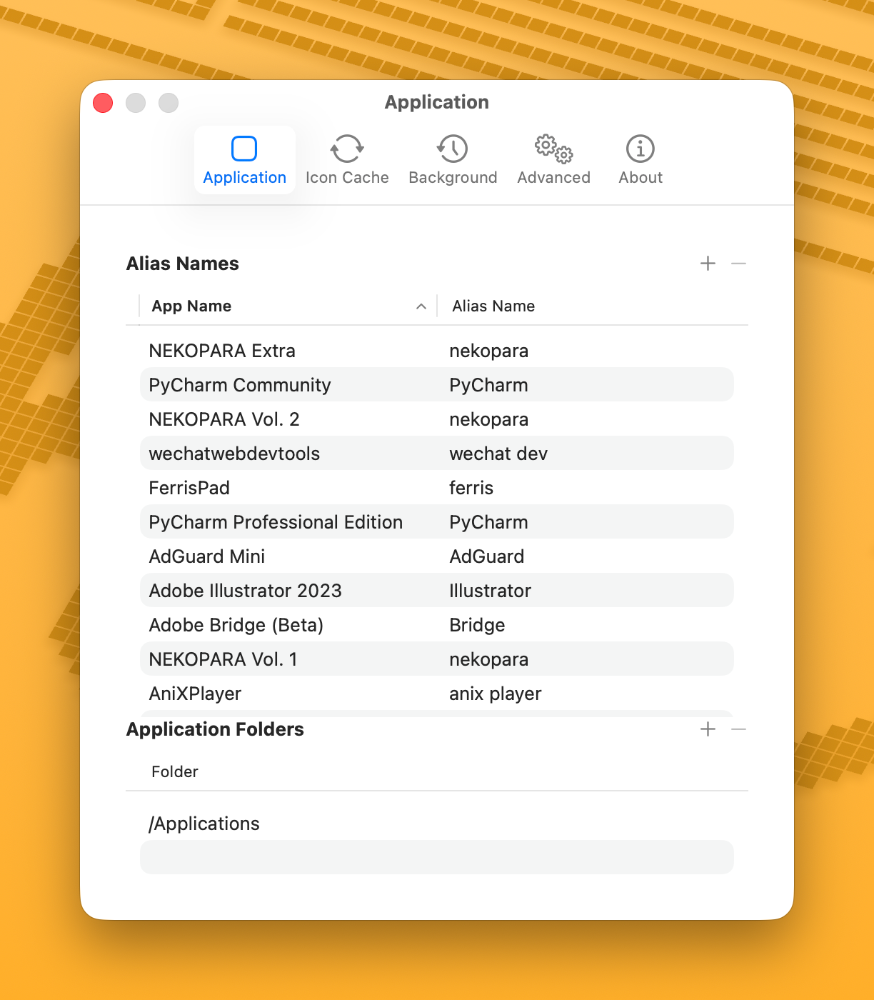

# 应用别名

有些应用的名称与图标搜索查询不太匹配。例如，"Adobe Photoshop 2024" 可能搜索不到好的结果，但 "Photoshop" 就可以。别名可以为应用设置一个更适合搜索的名称。

## 设置别名

1. 右键侧边栏中的应用。
2. 选择 **设置别名**。
3. 输入便于搜索的名称（如 `Photoshop` 而不是 `Adobe Photoshop 2024`）。

<!--  -->

搜索图标时会使用别名进行搜索。

## 管理别名

在 **设置** > **应用** > **别名** 中查看和编辑所有别名。

<!--  -->

## 内置别名

IconChanger 内置了一些常见应用的别名：
- `PyCharm Professional Edition` → `PyCharm`
- `Discord PTB` → `Discord`

## 提示

- 别名越短、越通用，搜索结果越好。
- 别名会包含在[导出配置](./import-export)中。
